<h1>THE GAME</h1>
 
<h2>Background Information: </h2>

Lone is a whimsical adaptation of the classic card game, ‘Old Maid’.  
Don’t be lonely! Avoid being left alone by aiming to pair up cards at each turn.
 

 
<h2>Description and Rules:</h2>
<ol>
<li>[start] Upon starting the game, cards will be dealt at random to each player. One player will have an extra card. At this point, don’t fret if you end up with Lone!</li>
<li>[click any card from computer] Select any card from your opponent by clicking on it. This card will be added into your hands.</li>
<li>[discard] If you see two similar cards, congratulations, you have a pair! Discard the pair by clicking the discard button. Be mindful, you can only discard once per turn. If you have no pairs, click ‘Done’.</li>
<li>[done] Click Done to end your turn, and your opponent will commence their turn. In the same way, they will select a random card from you and discard a pair of their own if they do end up with a pair. If your opponent happens to select a Lone card, you just got rid of the Lone card and increased your chance of winning! However, you risk getting a card that can be paired up taken away if you forget to discard your pair during your turn.</li>
</ol>
   
<h2>How to win?</h2>

The player that ends up with the Lone card loses, and the player that manages to discard all their cards wins.

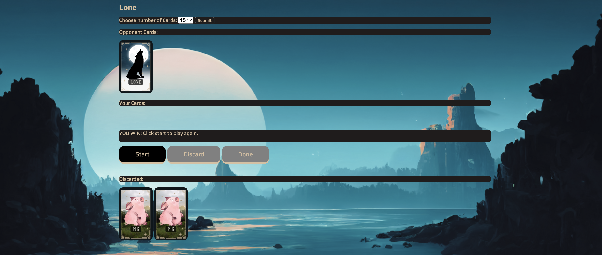
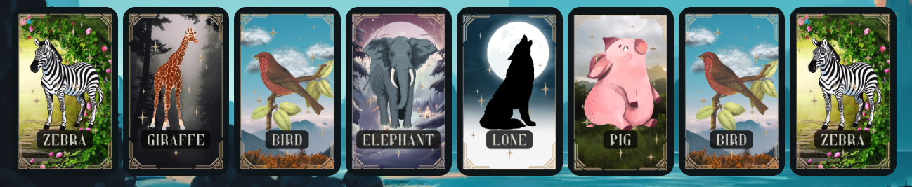
 
<h2>The Game: </h2>

The losing situation, when player ends up with the lone card

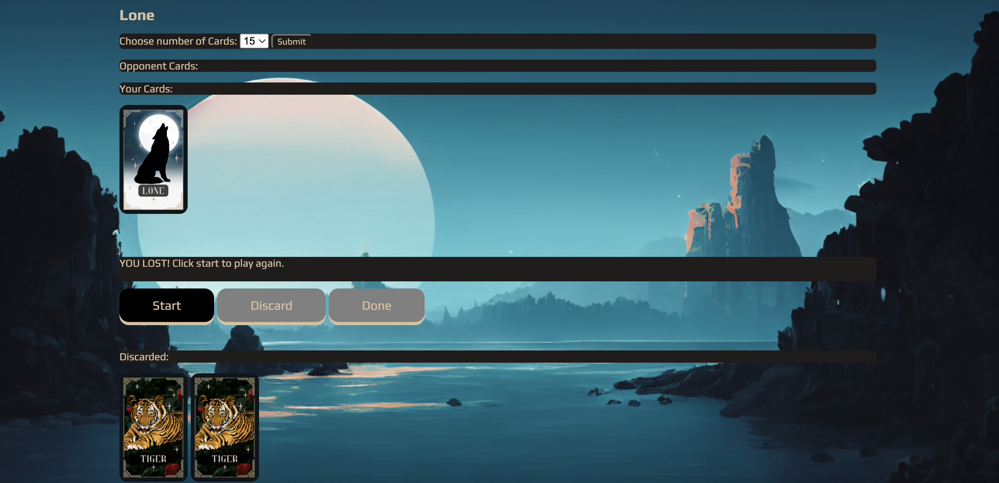
 

Game message prompts player to click 'done' instead of 'discard' when they have no pairs.

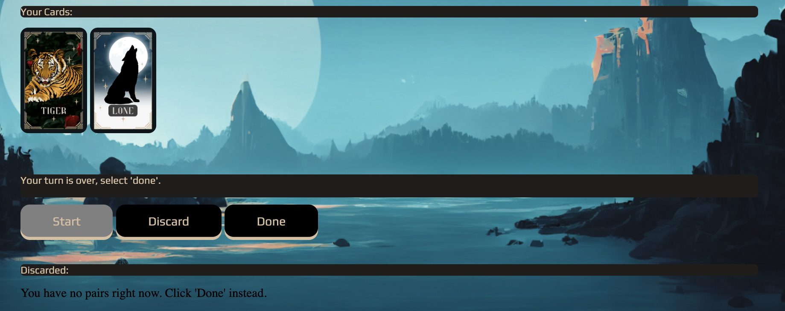
 
<h2>Technologies Used: </h2>

 
 
<h2>Figma Ideation: </h2>

Wire Frame

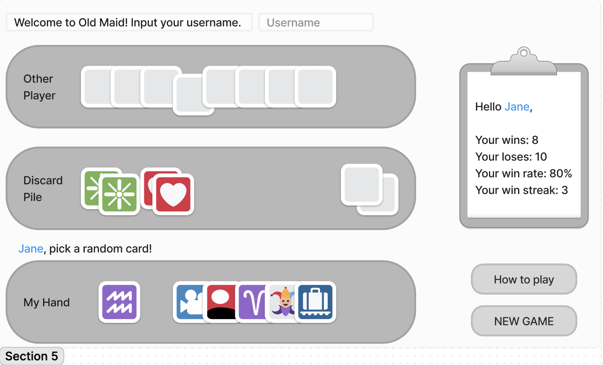

Sections to include on the game page. This would end up being my main sections in the HTML file.

 

Game Flow:

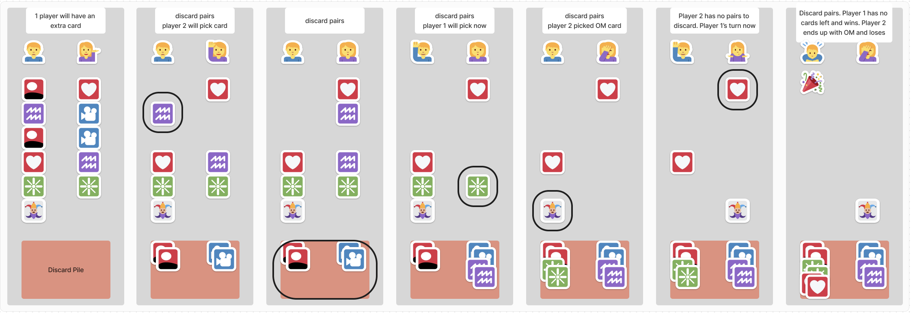

Think about the flow of the game and visualise how it will be played.

 

Game Conditionals:

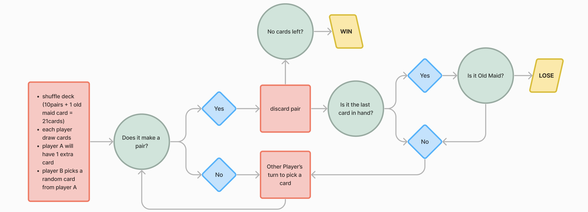

Consider helper functions, conditionals, and global scope variables

 

Figma -> https://www.figma.com/file/FWtpHUGTqsCVNScHibEzm5/Project-1%3A-Old-Maid?type=whiteboard&node-id=0%3A1&t=9OQIWSQNeaZS9cgF-1

 
<h2>Lets get coding: </h2>

Favourite Function:

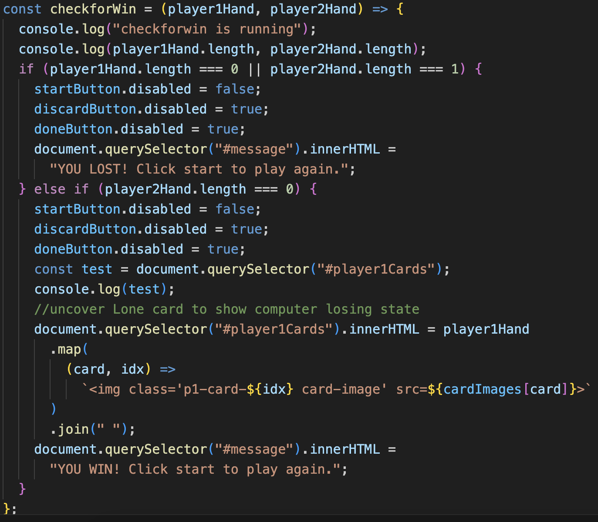
 

Biggest Challenge:

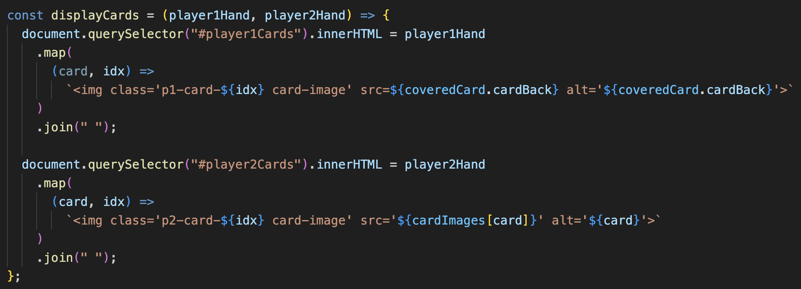

Covering of the computer cards for player to select card fairly. I also had to flip back the last Lone card in the event that the computer loses. On top of that, I also had to reshuffle this array because the randomly picked card would always be pushed to be the last element of the array.

 

Key Takeaways:

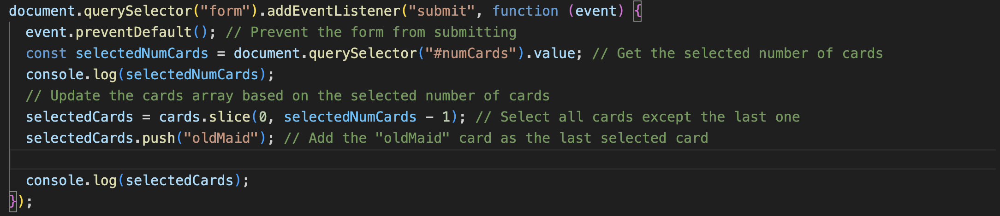

I practiced using select forms in order for player to select a varying number of cards.

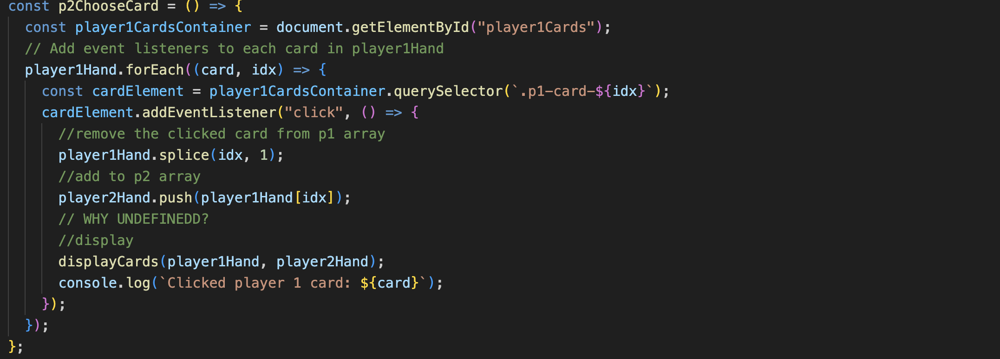

I also did DOM manipulation quite frequently for this game as the computer cards had to be clickable at different points of the game depending on who's turn it is, and also redefining the contents of the HTML display whenever a pair was discarded, or whenever a card was selected.

 
<h2>Getting Started: </h2>

Play Lone here! -> https://lone-beta.vercel.app/

 
<h2>Important instructions: </h2>

Select the number of cards you want to play with and click submit before starting the game
  
 
<h2>Ice Box:</h2>
<ul></ul>
<li>Future enhancements multiplayer game modes.</li>
<li>Updates will also take username input and utilise it in game messages for a more personalised gameplay.</li>
<li>Adding on, Lone will aspire to track win rates with the username for repeated players.</li>
</ul>
 
<h2>Credits and References</h2>
<ul>
  <li>Card Creation in Canva -> https://www.canva.com/</li>
  <li>Buttons -> https://www.joshwcomeau.com/animation/3d-button/#color-and-aesthetics-7</li>
  <li>StackOverFlow</li>
  <li>Simon and Faith</li>
</ul>
